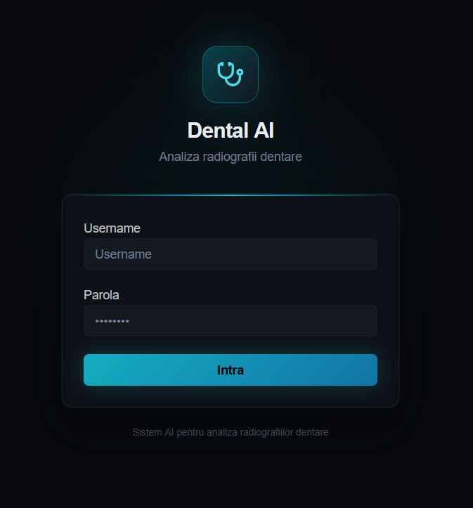
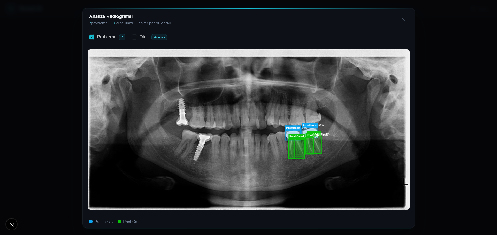
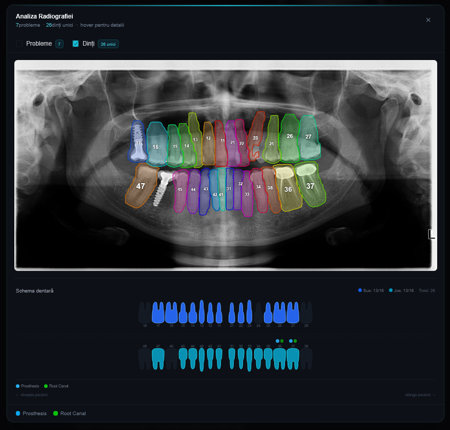
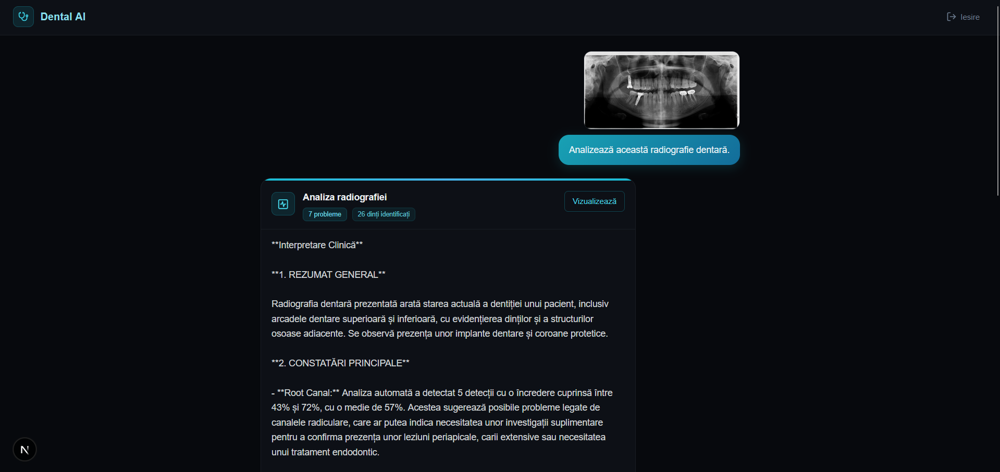

# Dental AI — Analiză Radiografii Dentare

**Mihai Moranciu** · Master SIMPRE · Grupa 1146

---

**Link video prezentare:** https://youtu.be/UOJj7QkqQLQ

**Link publicare aplicație:** https://ai-chatbot-plugin-three.vercel.app

---

## 1. Introducere

**Dental AI** este o aplicație web care permite medicilor stomatologi să încarce radiografii dentare și să primească o interpretare clinică automată generată de AI. Aplicația combină două servicii cloud:

- **Roboflow** — detectarea obiectelor pe radiografie (carii, restaurări, endodontice, etc.) și segmentarea individuală a dinților
- **Groq** — interpretarea clinică a rezultatelor detectării, folosind modelul multimodal *Llama 4 Scout 17B*

Aplicația include și un modul de chat general cu AI, unde medicul poate pune întrebări și poate atașa imagini.

**Tehnologii folosite:**

| Tehnologie | Rol |
|---|---|
| Next.js 15 (App Router) | Framework full-stack, routing, API routes |
| TypeScript | Limbaj de programare |
| Tailwind CSS v4 | Stilizare UI |
| shadcn/ui | Componente UI (Card, Button, Input, Label) |
| Groq API | Inferență LLM — model Llama 4 Scout 17B |
| Roboflow API | Computer vision — detectare și segmentare dentară |
| HTTP-only Cookie | Persistența sesiunii de autentificare |

---

## 2. Descriere Problemă

Interpretarea radiografiilor dentare necesită experiență clinică specializată și timp considerabil. Medicii stomatologi trebuie să identifice manual carii, tratamente endodontice, restaurări, impactări și alte probleme vizibile pe radiografie.

Dental AI automatizează această etapă prin:

1. **Detectare automată** — modelele de computer vision Roboflow identifică și localizează problemele pe radiografie
2. **Interpretare clinică** — modelul Llama 4 Scout de la Groq primește detecțiile și imaginea originală și generează un raport clinic structurat în limba română
3. **Vizualizare interactivă** — rezultatele sunt afișate suprapus pe imagine și mapate pe o schemă dentară FDI

Aplicația nu înlocuiește medicul, ci îi oferă un punct de plecare rapid pentru analiza radiografiei.

---

## 3. Descriere API

Aplicația expune trei endpoint-uri REST proprii și consumă două API-uri externe.

### 3.1 API-uri proprii (Next.js Route Handlers)

#### `POST /api/login`
Autentificarea utilizatorului. Setează un cookie de sesiune httpOnly cu durata de 8 ore.

#### `DELETE /api/login`
Delogare. Șterge cookie-ul de sesiune.

#### `POST /api/chat`
Chat general cu AI. Acceptă text și opțional o imagine. Returnează răspunsul modelului Groq.

#### `POST /api/xray`
Trimite radiografia la Roboflow și returnează detecțiile de probleme dentare și segmentarea dinților.

#### `POST /api/xray/interpret`
Trimite radiografia și detecțiile la Groq pentru interpretare clinică structurată.

---

### 3.2 API-uri externe consumate

#### Groq API
- **Base URL:** `https://api.groq.com/openai/v1`
- **Model:** `meta-llama/llama-4-scout-17b-16e-instruct`
- **Autentificare:** Bearer token (`Authorization: Bearer <GROQ_API_KEY>`)
- **Documentație:** https://console.groq.com/docs

#### Roboflow API
- **Detectare probleme:** `https://detect.roboflow.com/<model_id>/<version>`
- **Segmentare dinți:** `https://serverless.roboflow.com/<model_id>/<version>`
- **Autentificare:** Query parameter (`?api_key=<ROBOFLOW_API_KEY>`)
- **Documentație:** https://docs.roboflow.com

---

## 4. Flux de Date

### 4.1 Autentificare

```
Client                          Server (Next.js)
  |                                    |
  |  POST /api/login                   |
  |  { username, password }  --------> |
  |                                    |  Verifică credențiale din .env
  |  <-------- 200 OK                  |
  |  Set-Cookie: session=<secret>      |  Cookie httpOnly, SameSite=lax, 8h
  |                                    |
  |  (orice request ulterior)          |
  |  Cookie: session=<secret> -------> |
  |                                    |  middleware.ts verifică cookie
  |  <-------- răspuns normal          |
```

**Cookie-ul de sesiune persistă la refresh** — este stocat de browser și trimis automat la fiecare request, iar middleware-ul Next.js verifică validitatea lui înainte de a permite accesul la orice rută privată.

---

### 4.2 Analiză radiografie — flux complet

```
Client                    Next.js API              Roboflow             Groq
  |                           |                       |                   |
  |  POST /api/xray           |                       |                   |
  |  FormData(image) -------> |                       |                   |
  |                           |  POST detect.roboflow.com (base64)        |
  |                           |  POST serverless.roboflow.com (base64)    |
  |                           |  (apeluri paralele)   |                   |
  |                           | <----- detecții JSON -|                   |
  |                           |  NMS + deduplicare + filtrare outlieri    |
  | <---- detecții curate --- |                       |                   |
  |                           |                       |                   |
  |  POST /api/xray/interpret |                       |                   |
  |  FormData(image+detectii) |                       |                   |
  |  -----------------------> |                       |                   |
  |                           |  POST api.groq.com/openai/v1/chat/completions
  |                           |  (prompt structurat + imagine) ---------->|
  |                           | <------------------------ raport clinic --|
  | <------- raport JSON ---- |                       |                   |
```

---

### 4.3 Exemple request / response

#### Autentificare — `POST /api/login`

**Request:**
```http
POST /api/login HTTP/1.1
Content-Type: application/json

{
  "username": "mihai.moranciu",
  "password": "parola123"
}
```

**Response (succes):**
```http
HTTP/1.1 200 OK
Set-Cookie: session=<secret>; Path=/; HttpOnly; SameSite=Lax; Max-Age=28800

{
  "ok": true
}
```

**Response (eroare):**
```http
HTTP/1.1 401 Unauthorized

{
  "error": "User sau parola incorecte."
}
```

---

#### Chat AI — `POST /api/chat`

**Request:**
```http
POST /api/chat HTTP/1.1
Cookie: session=<secret>
Content-Type: multipart/form-data

prompt: "Ce este o carie dentară?"
image: (opțional, fișier imagine)
```

**Response:**
```json
{
  "reply": "O carie dentară este o boală infecțioasă cronică ce afectează..."
}
```

**Response (neautorizat):**
```http
HTTP/1.1 401 Unauthorized

{
  "error": "Neautorizat"
}
```

---

#### Detectare radiografie — `POST /api/xray`

**Request:**
```http
POST /api/xray HTTP/1.1
Cookie: session=<secret>
Content-Type: multipart/form-data

image: <fișier radiografie>
```

**Response:**
```json
{
  "dentalProblems": [
    {
      "x": 312,
      "y": 198,
      "width": 45,
      "height": 38,
      "confidence": 0.74,
      "class": "caries",
      "detection_id": "abc123"
    },
    {
      "x": 520,
      "y": 210,
      "width": 40,
      "height": 35,
      "confidence": 0.61,
      "class": "Root Canal",
      "detection_id": "def456"
    }
  ],
  "teethSeg": [
    {
      "x": 300,
      "y": 195,
      "width": 50,
      "height": 42,
      "confidence": 0.89,
      "class": "11",
      "detection_id": "ghi789"
    }
  ],
  "imageWidth": 1024,
  "imageHeight": 768
}
```

**Clase detectate de Roboflow:**

| Clasă | Descriere |
|---|---|
| `caries` | Carie dentară |
| `Root Canal` | Tratament endodontic |
| `restoration` | Restaurare (obturaţie) |
| `Prosthesis` | Proteză |
| `impaction` | Impactare dentară |
| `root stump` | Rest radicular |

---

#### Interpretare clinică — `POST /api/xray/interpret`

**Request:**
```http
POST /api/xray/interpret HTTP/1.1
Cookie: session=<secret>
Content-Type: multipart/form-data

image: <fișier radiografie>
detections: {"dentalProblems":[...],"teethSeg":[...]}
```

**Response:**
```json
{
  "reply": "**1. REZUMAT GENERAL**\nRadiografia prezintă o dentiție cu modificări patologice moderate...\n\n**2. CONSTATĂRI PRINCIPALE**\n..."
}
```

---

### 4.4 Metode HTTP utilizate

| Endpoint | Metodă | Descriere |
|---|---|---|
| `/api/login` | `POST` | Autentificare, setare sesiune |
| `/api/login` | `DELETE` | Delogare, ștergere sesiune |
| `/api/chat` | `POST` | Trimitere mesaj chat cu AI |
| `/api/xray` | `POST` | Detectare probleme pe radiografie |
| `/api/xray/interpret` | `POST` | Interpretare clinică AI |

---

### 4.5 Autentificare și autorizare servicii

**Autentificare proprie (sesiune):**
- La login, serverul setează un cookie `session` httpOnly cu valoarea `SESSION_SECRET` din `.env`
- Middleware-ul Next.js (`middleware.ts`) interceptează toate request-urile și verifică prezența și validitatea cookie-ului
- Rutele publice (fără autentificare): `/login`, `/api/login`
- Toate celelalte rute necesită cookie valid; altfel redirect la `/login`

**Groq API:**
- Autentificare prin Bearer token în header-ul `Authorization`
- Cheia se stochează în variabila de mediu `GROQ_API_KEY`
- Cheia nu este expusă clientului — toate apelurile se fac server-side din Route Handlers

**Roboflow API:**
- Autentificare prin query parameter `api_key`
- Cheia se stochează în variabila de mediu `ROBOFLOW_API_KEY`
- Toate apelurile se fac server-side, cheia nu ajunge în browser

---

## 5. Capturi Ecran Aplicație

### Pagina de autentificare


### Interfața de chat


### Analiză radiografie — detecții


### Modal rezultate — schemă dentară FDI


### Interpretare clinică AI


> *Capturile de ecran se află în directorul `docs/screenshots/`.*

---

## 6. Referințe

- [Next.js Documentation](https://nextjs.org/docs)
- [Groq API Documentation](https://console.groq.com/docs)
- [Roboflow Documentation](https://docs.roboflow.com)
- [Llama 4 Scout — Meta](https://ai.meta.com/blog/llama-4-multimodal-intelligence/)
- [shadcn/ui](https://ui.shadcn.com)
- [Tailwind CSS](https://tailwindcss.com)
- [FDI World Dental Federation — Tooth Numbering](https://www.fdiworlddental.org)
